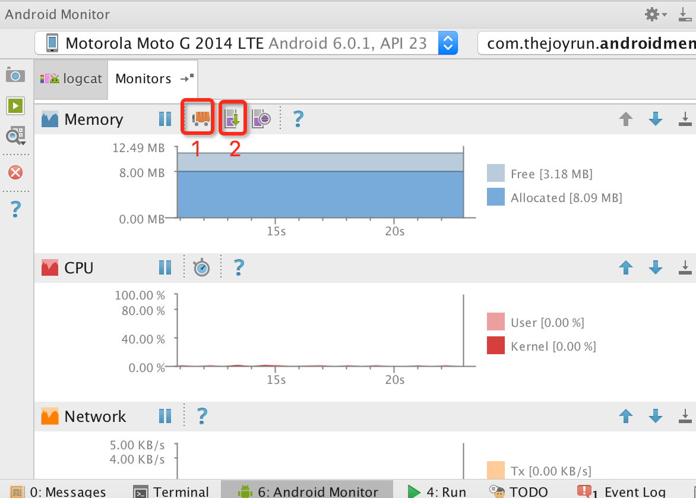
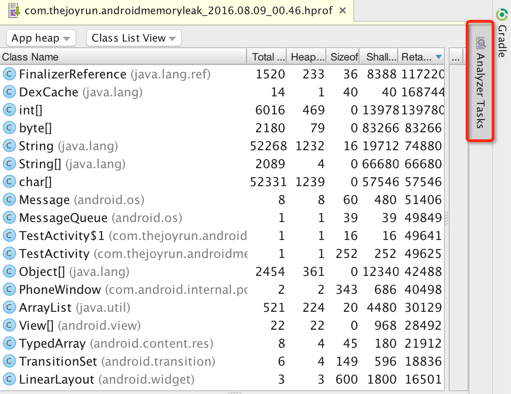
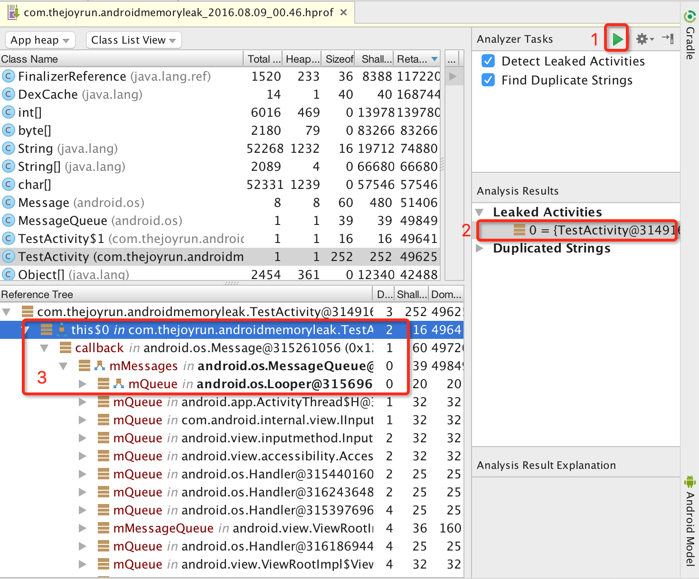
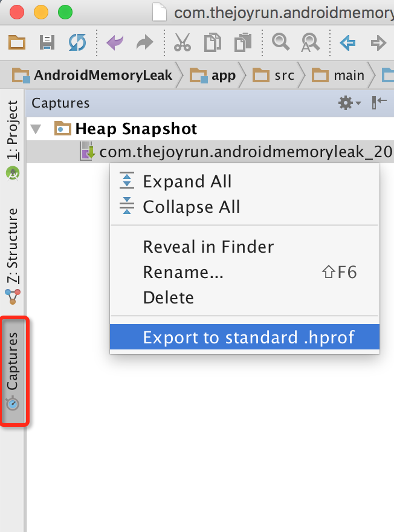
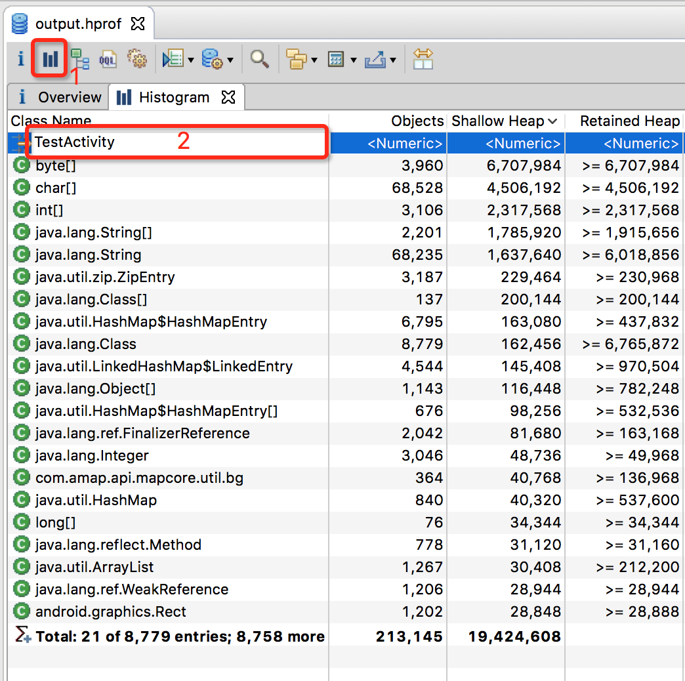
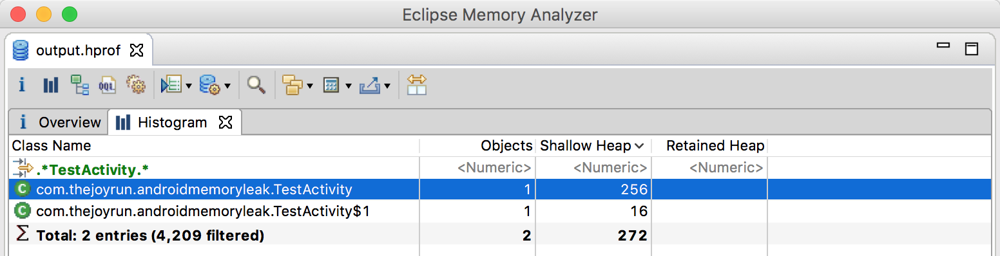
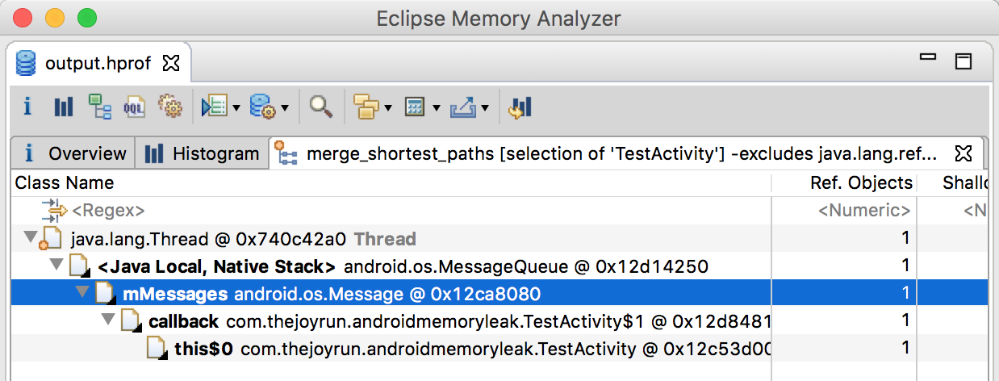

Android开发中难免会遇到各种内存泄露，如果不及时发现处理，会导致出现内存越用越大，可能会因为内存泄露导致出现各种奇怪的crash，甚至可能出现因内存不足而导致APP崩溃。

### 内存泄露分析工具

Android的内存泄露分析工具常用有Android Studio和基于eclipse的MAT（Memory Analyzer Tool）。通过两者配合，可以发挥出奇妙的效果。Android Studio能够快速定位内存泄露的Activity，MAT能根据已知的Activity快速找出内存泄露的根源。

### 第一步：强制GC，生成Java Heap文件

我们都知道Java有一个非常强大的垃圾回收机制，会帮我回收无引用的对象，这些无引用的对象不在我们内存泄露分析的范畴，Android Studio有一个`Android Monitors`帮助我们进行强制GC，获取`Java Heap`文件。

> 强制GC：点击`Initate GC`(1)按钮，建议点击后等待几秒后再次点击，尝试多次，让GC更加充分。然后点击`Dump Java Heap `(2)按钮，然后等到一段时间，生成有点慢。



> 生成的Java Heap文件会在新建窗口打开。



### 第二步：分析内存泄露的Activity

点击`Analyzer Tasks`的`Perform Analysis`(1)按钮，然后等待几秒十几秒不等，即可找出内存泄露的Activity(2)。



那么我们就可以知道内存泄露的Activity，因为这个例子比较简单，其实在(3)就已经可以看到问题所在，如果比较复杂的问题Android Studio并不够直观，不够MAT方便，如果Android Studio无法解决我们的问题，就建议使用MAT来分析，所以下一步我们就生成标准的hprof文件，通过MAT来找出泄露的根源。

### 第三步：转换成标准的hprof文件

刚才生成的Heap文件不是标准的Java Heap，所以MAT无法打开，我们需要转换成标准的Java Heap文件，这个工具Android Studio就有提供，叫做`Captures`,右击选中的`hprof`，`Export to standard .hprof`选择保存的位置，即可生成一个标准的hprof文件。



### 第四步：MAT打开hprof文件

MAT的[下载地址](http://www.eclipse.org/mat/downloads.php)，使用方式和eclipse一样，这里就不多说了，打开刚才生成的hprof文件。点击(1)按钮打开Histogram。(2)这里是支持正则表达式，我们直接输入Activity名称，点击`enter`键即可。



> 搜索到了目标的Activity



> 右击搜索出来的类名，选择`Merge Shortest Paths to GC Roots`的`exclude all phantom/weak/soft etc. references`，来到这一步，就可以看到内存泄露的原因，我们就需要根据内存泄露的信息集合我们的代码去分析原因。



### 第六步：根据内存泄露信息和代码分析原因

使用Handler案例分析，给出的信息是Thread和android.os.Message，这个Thread和Message配合通常是在Handler使用，结合代码，所以我猜测是Handler导致内存泄露问题，查看代码，直接就在函数中定义了一个final的Handler用来定时任务，在Activity的onDestroy后，这个Handler还在不断地工作，导致Activity无法正常回收。

```java
// 导致内存泄露的代码
protected void onCreate(Bundle savedInstanceState) {
super.onCreate(savedInstanceState);
setContentView(R.layout.activity_test);
textView = (TextView) findViewById(R.id.text);
final Handler handler = new Handler();
handler.post(new Runnable() {
 @Override
 public void run() {
   textView.setText(String.valueOf(timer++));
   handler.postDelayed(this, 1000);
  }
 });
}
```

##### 修改代码，避免内存泄露

```java
@Override
protected void onCreate(Bundle savedInstanceState) {
super.onCreate(savedInstanceState);
setContentView(R.layout.activity_test);
textView = (TextView) findViewById(R.id.text);
handler.post(new Runnable() {
 @Override
 public void run() {
  textView.setText(String.valueOf(timer++));
  if (handler != null) {
   handler.postDelayed(this, 1000);
  }
 }
});
}
private Handler handler = new Handler();
@Override
protected void onDestroy() {
 super.onDestroy();
 // 避免Handler导致内存泄露
 handler.removeCallbacksAndMessages(null);
 handler = null;
}
```
重新测试，确保问题已经解决。

